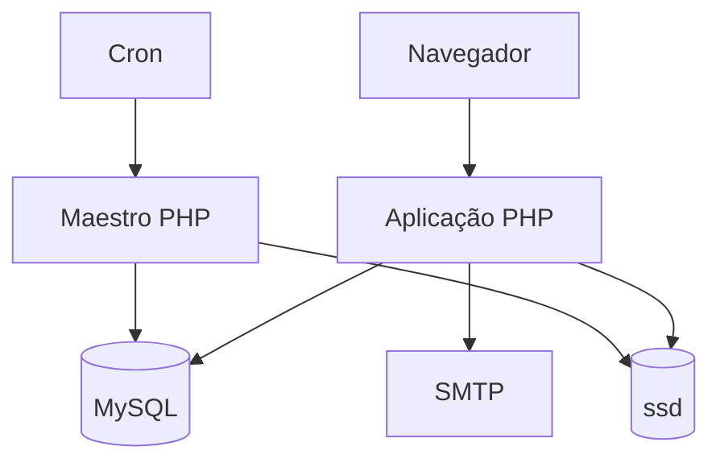

# C4 — contêineres

## Aplicação PHP

Processa HTTP, autenticação, autorização, casos de uso e renderização. O deploy é monolítico, mas o código é modular.

## MySQL

Armazena dados operacionais, identidades, permissões, ledger, auditoria e contratos persistentes.

## `ssd`

Área persistente fora do código publicado. Contém documentos, imagens, caches, filas, locks e estados operacionais.

## Maestro

Executa trabalho secundário durável e idempotente fora do caminho crítico da requisição.

## SMTP

Adaptador opcional para envio de mensagens.
