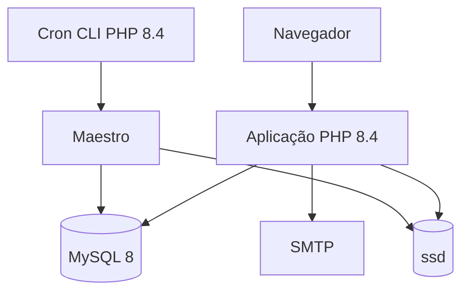

# C4 — contêineres

## Aplicação PHP

Deploy monolítico, código modular. Internamente, o runtime compõe `Presentation → Application → Domain/Core` e implementações de `Infrastructure`. `Runtime/Composition` é o único ponto autorizado a conectar todas as camadas. O carregamento é orientado por módulos/rotas e separa prontidão mínima de manutenção profunda.

## MySQL

Armazena dados operacionais, identidades, permissões, action ledger, auditoria e contratos persistentes. O runtime comum não executa DDL. Operações protegidas revalidam contexto vivo e mutações críticas preservam prova/transação conforme as invariantes.

## `ssd`

Área persistente fora do código publicado. Contém documentos, imagens, caches JSON por geração, telemetria, filas/spools, locks e estados operacionais. Indisponibilidade de cache/lock não transforma checks de segurança em sucesso: os caminhos críticos usam fallback seguro quando definido.

## Maestro

Executa trabalho secundário durável e idempotente fora do caminho crítico. O ciclo é supervisionado, possui preflight somente leitura, orçamento e saúde por estágio, retry/backoff e dead-letter.

## SMTP

Adaptador externo opcional. Integrações externas pertencem a Infrastructure e são conectadas por Composition.

## Fronteira de implantação

Web e CLI usam exclusivamente a família PHP 8.4. CI reproduz PHP 8.4 e MySQL 8 para contratos e smoke tests críticos.
