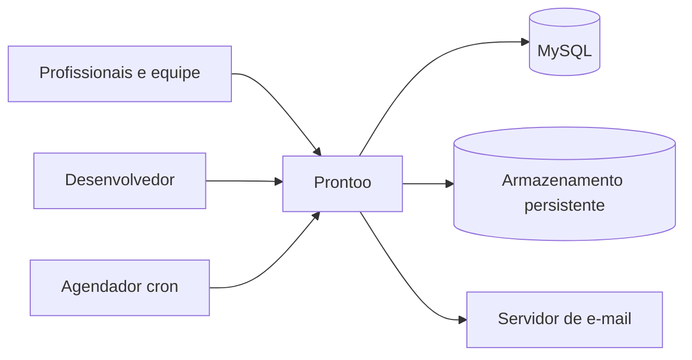

# C4 — contexto

## Pessoas

**Profissionais e equipe** usam agenda, pacientes, documentos, tarefas e financeiro conforme cargos ativos.

**Desenvolvedor** administra recursos globais e executa operações privilegiadas com MFA e reautenticação.

## Sistemas externos

**MySQL** é a fonte canônica para dados, credenciais, permissões e integridade.

**Armazenamento persistente** mantém PDFs, imagens, filas e estados operacionais sob `ssd`.

**Servidor de e-mail** entrega comunicações quando configurado.

**Cron** inicia ciclos do Maestro.
