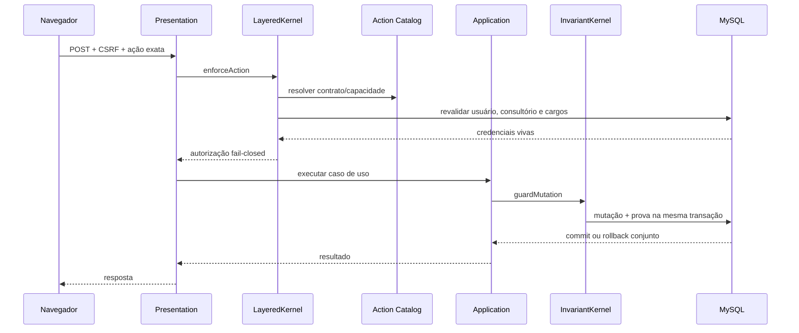
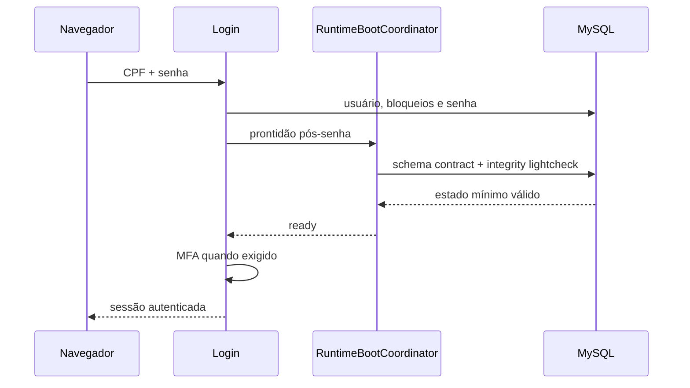

# Fluxos de dados

## Ação protegida

O catálogo de ações é definido em `Application/Authorization` e composto por `Runtime/Authorization`. Adaptadores concretos não decidem autorização.

## Login e prontidão

Prontidão mínima e manutenção profunda possuem marcadores separados. Login não executa Maestro contract, autoteste profundo, cleanup ou runtime self-check no caminho síncrono. Se cache/lock de prontidão estiver indisponível, os checks mínimos são executados sem cache em vez de liberar a rota sem validação.

## Logout

A geração canônica do usuário é rotacionada e a sessão local é destruída. Auditoria secundária segue por spool/fila durável assinada, com retry, dead-letter e consumo idempotente pelo Maestro. Telemetria da navegação é encerrada separadamente.

## Maestro

O ciclo é supervisionado no servidor, com orçamento residual, preflight somente leitura, estágios de saúde independentes e envelopes duráveis. Processamento é idempotente; falhas seguem política de retry/backoff e dead-letter sem transformar manutenção administrativa em efeito colateral do hot path.

## Leitura e escrita por feature

Presentation chama `Application Service`; Application depende de uma porta; Composition injeta a implementação PDO de Infrastructure. Em comandos críticos, o repositório concreto mantém locks, mutação e persistência na mesma transação, enquanto Core protege invariantes e escopo.
