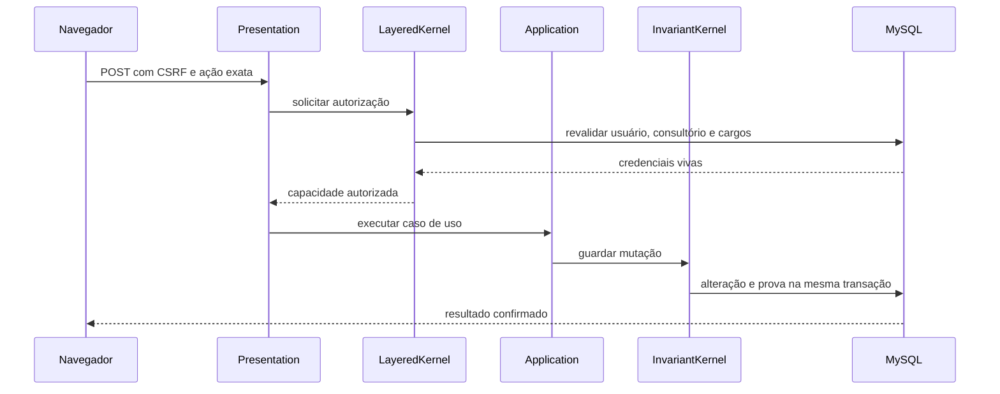

# Fluxos de dados

## Ação protegida

## Login

Senha, estado do usuário, bloqueios e MFA são avaliados antes da criação da sessão. Estados indeterminados falham fechados.

## Logout

A geração canônica do usuário é rotacionada e a sessão local é destruída. A auditoria secundária segue por fila durável. A telemetria da rota é concluída separadamente pelo marcador de encerramento da própria requisição.

## Maestro

O ciclo possui orçamento residual único. Envelopes são assinados, processados de forma idempotente e enviados à fila morta quando excedem a política de tentativas.
