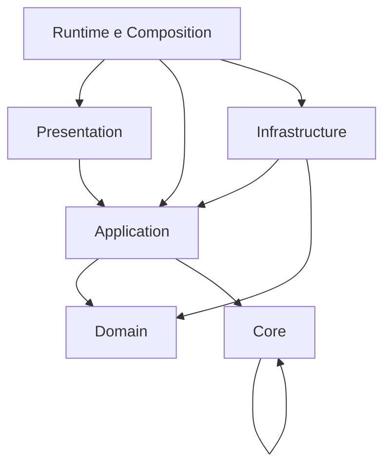

# Visão arquitetural

## Estilo

O Prontoo é um monólito modular em PHP com arquitetura em camadas e núcleo de invariantes. Não é MVC clássico, embora a borda HTTP possua responsabilidades equivalentes a controller e view.

## Objetivos

- manter regras de negócio independentes de HTTP e PDO;
- concentrar autorização, isolamento e integridade;
- reduzir o caminho crítico das requisições;
- tornar falhas explícitas e auditáveis;
- permitir evolução incremental sem refatorações destrutivas.

## Camadas

As setas representam dependências de código. `Core` e `Domain` não dependem de `Infrastructure` ou `Presentation`.

## Pontos de entrada

- autorização: `Prontoo\Runtime\LayeredKernel::enforceAction`;
- mutações: `Prontoo\Core\Invariant\InvariantKernel::guardMutation`;
- runtime web: arquivos em `br`;
- tarefas secundárias: `cron/maestro.php`;
- instalação: rota explícita e janela estrutural controlada.

## Fronteiras transitórias

`Pages`, `Admin`, `Auth` e `Ui` contêm partes legadas ou agregadoras. Alterações nessas áreas devem extrair regras para as camadas corretas, sem ampliar acoplamento.

## Qualidades prioritárias

1. isolamento;
2. integridade;
3. segurança;
4. consistência operacional;
5. legibilidade;
6. desempenho;
7. extensibilidade.
