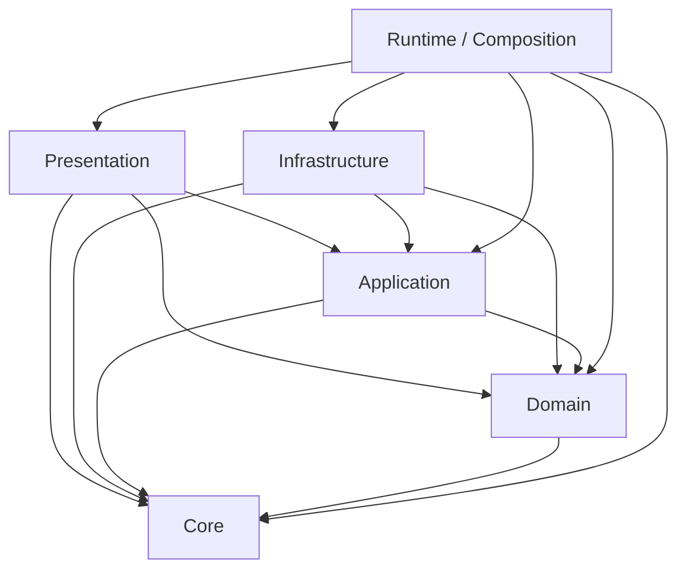

# Visão arquitetural

## Estado atual

O Prontoo é um **monólito modular PHP 8.4 em camadas com núcleo de invariantes**. A migração estrutural não depende mais apenas de grandes fachadas históricas: responsabilidades foram decompostas em unidades nativas de `Core`, `Domain`, `Application`, `Infrastructure`, `Presentation` e `Runtime/Composition`, enquanto não há fachadas globais de compatibilidade; apenas entrypoints e ferramentas procedurais permanecem fora da contagem de unidades nativas.

A fonte executável de verdade para classificação e dependências é `app/Core/Architecture/LayerMap.php`; o manifesto arquitetural fixa cobertura de classificação em 100%, piso de unidades nativas e teto de fronteiras transitórias.

## Objetivos

- manter regras de negócio independentes de HTTP e PDO;
- concentrar autorização, isolamento, integridade e prova de mutação;
- manter composition root explícito e carregamento orientado à rota;
- reduzir o caminho crítico de login e requisições normais;
- tornar falhas explícitas, auditáveis e fail-closed;
- preservar compatibilidade enquanto unidades históricas são classificadas e decompostas;
- impedir regressão estrutural por contratos executáveis.

## Camadas

As setas representam dependências permitidas. `Core` é autocontido; `Domain` não conhece infraestrutura/apresentação; `Application` não conhece adaptadores externos; `Infrastructure` e `Presentation` não dependem entre si; `Composition` é a única camada que pode conhecer todas as demais.

## Núcleo de invariantes

`app/Core/Invariant` contém decisões canônicas de contexto, mutação, SQL, tenant, workflow e prova. A mutação protegida entra por `Prontoo\Core\Invariant\InvariantKernel::guardMutation`. A autorização entra por `Prontoo\Runtime\LayeredKernel::enforceAction`, que compõe catálogo de ações e capacidades com credenciais vivas.

## Runtime e composição

A composição foi decomposta em unidades coesas:

- `app/Runtime/Modules/RuntimeBootPolicy.php` — política de boot;
- `RuntimeModuleCatalog.php` — catálogo de módulos;
- `RuntimeModuleLoader.php` — carregamento;
- `RuntimeModuleComposition.php` — wiring concreto;
- `app/Runtime/Routing/RouteCatalog.php` — catálogo de rotas;
- `app/Runtime/Boot/RuntimeBootCoordinator.php` — prontidão mínima e manutenção profunda;
- `app/Runtime/Authorization/ActionCatalogComposition.php` — composição do catálogo de autorização;
- composições específicas de Pacientes e Financeiro em `app/Runtime/Patients` e `app/Runtime/Financial`;
- `app/Runtime/Runner.php` — coordenação final do runtime.

A fachada global `app/Support/ModuleLoader.php` foi removida. Entrypoints e unidades de runtime consomem diretamente `RuntimeModuleComposition`, `RuntimeBootPolicy`, `RouteCatalog`, `JsonResponder` e as composições de feature.

## Prontidão versus manutenção

Login e rotas normais verificam somente contrato de schema e `integrity lightcheck`. O marcador de prontidão é separado do marcador de manutenção profunda. Autotestes pesados, runtime self-check, cleanup e verificações profundas são executados fora do hot path quando explicitamente necessários. Falha de gravabilidade do cache/lock não dispensa os checks mínimos: eles executam sem cache.

## Compatibilidade `Legacy`

`Legacy` não significa camada arquitetural. Significa **origem histórica/compatibilidade**. Cada unidade `Legacy` reside dentro de uma camada real e deve obedecer às dependências dessa camada, por exemplo:

- `Domain/Legacy` — regra/contrato de domínio histórico;
- `Infrastructure/Legacy` — persistência ou integração histórica;
- `Presentation/Legacy` — HTML/UI/HTTP histórico;
- `Runtime/Legacy` — coordenação e compatibilidade de runtime.

A migração é monotônica: o número efetivo de unidades nativas não pode diminuir e o teto de fronteiras compatíveis não pode aumentar.

## Pontos de entrada

- web: front controllers em `br`/`public`;
- autorização: `Prontoo\Runtime\LayeredKernel::enforceAction`;
- mutações: `Prontoo\Core\Invariant\InvariantKernel::guardMutation`;
- runtime: `app/Runtime/Runner.php` e unidades de composição;
- tarefas secundárias: `cron/maestro.php`;
- instalação: `/install.php`, somente na janela explícita de comissionamento e banco vazio.

## Contratos arquiteturais

A arquitetura não é apenas documental. São gates permanentes:

- `tools/architecture-check.php`;
- `tools/solid-audit`;
- `tools/security-regression-check.php`;
- `tools/schema-check.php`;
- `tools/install-security-check.php`;
- `tools/login-post-password-runtime-check`;
- `.github/workflows/architecture.yml`.

## Qualidades prioritárias

1. isolamento multitenant;
2. integridade transacional e auditável;
3. segurança fail-closed;
4. consistência operacional;
5. compatibilidade controlada;
6. legibilidade e coesão;
7. desempenho do hot path;
8. extensibilidade sem regressão estrutural.
