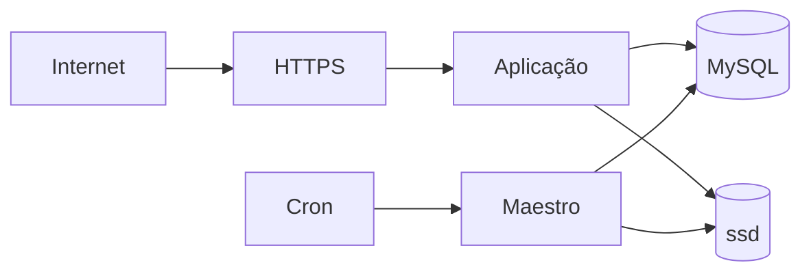

# Modelo de ameaças

## Ativos

- dados pessoais e clínicos;
- credenciais e fatores de autenticação;
- documentos;
- dados financeiros;
- trilha de auditoria;
- configuração de consultórios;
- segredos de aplicação.

## Ameaças prioritárias

- acesso entre consultórios;
- escalada de privilégio;
- sequestro de sessão;
- reutilização de fator;
- CSRF;
- injeção SQL;
- adulteração de auditoria;
- replay de fila;
- exposição de arquivo;
- instalação ou DDL não autorizado;
- inconsistência financeira;
- negação de serviço por consultas repetidas.

## Fronteiras de confiança

## Controles

- TLS e host canônico;
- CSRF;
- rate limits;
- MFA;
- contratos de ação;
- escopo multitenant;
- consultas parametrizadas;
- HMAC;
- nonce estrutural;
- transações;
- filas assinadas;
- logs sem dados sensíveis.

## Risco residual

Nenhum controle elimina risco. Mudanças críticas exigem testes negativos, revisão de ameaça e plano de rollback.
